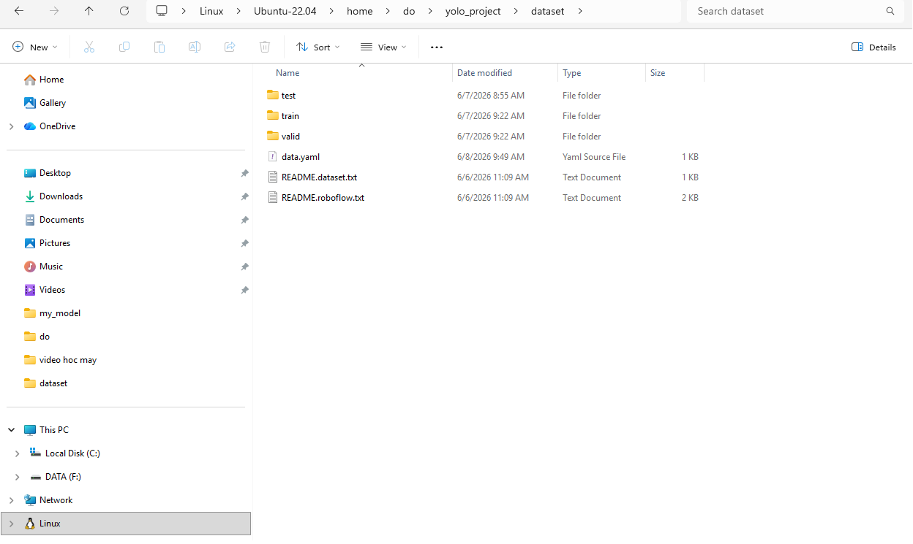
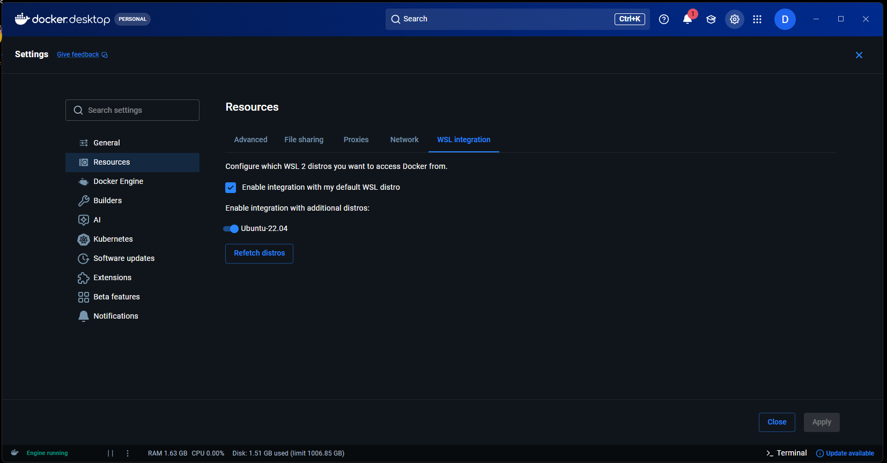
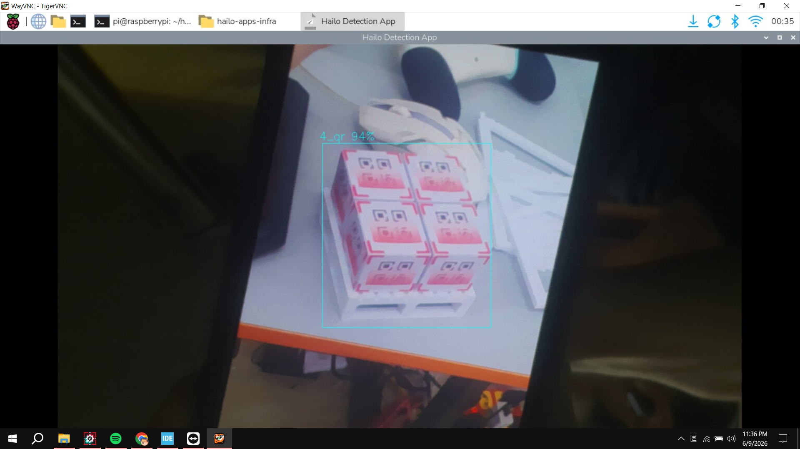
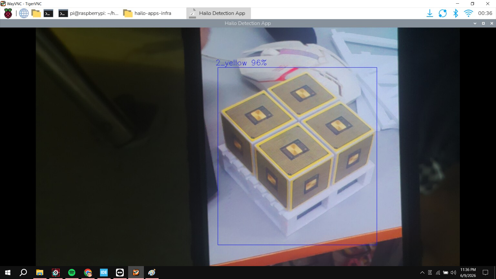
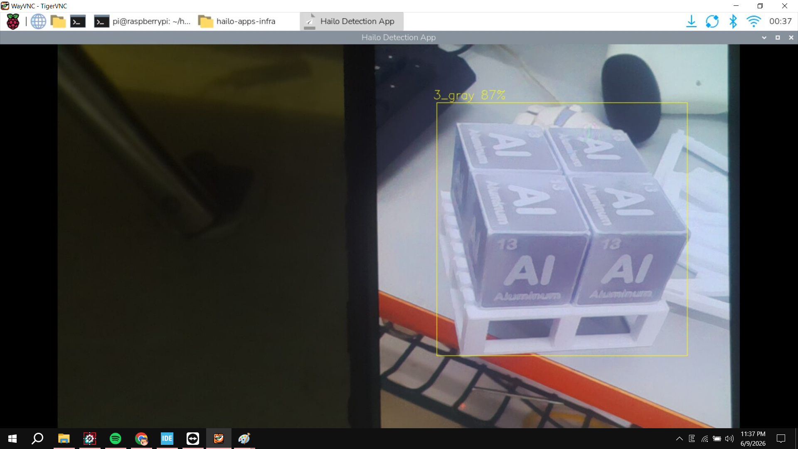
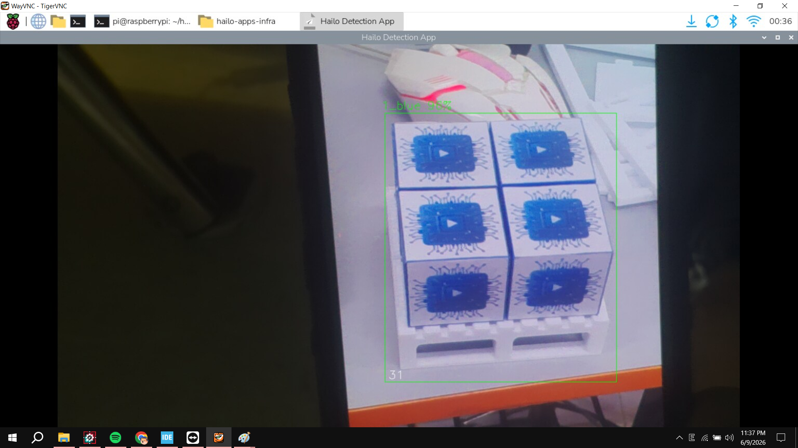

# Train YOLOv8s and Deploy on Raspberry Pi AI HAT (Hailo8L)

This guide walks through training a YOLOv8s model, converting it to HEF format, and deploying it on a Raspberry Pi with the AI HAT (Hailo8L, 13 TOPS).

Notes:
- Training is done on Ubuntu 22.04. If you don't want to install a separate OS, you can use WSL on Windows.
- The HEF conversion steps below are written for the Hailo8L AI HAT and may not work as-is with Hailo8 or Hailo10.

---

## 1. Check your environment

Check if a GPU is available:

```
nvidia-smi
```

Check CUDA version:

```
nvcc --version
```

Having CUDA available is recommended so training runs faster.

---

## 2. Update system and install Python tools

Update package lists:

```
sudo apt-get update
```

Upgrade pip:

```
pip install --upgrade pip
```

Install pip and venv:

```
sudo apt install python3-pip python3-venv -y
```

---

## 3. Create and activate a virtual environment

Creating a virtual environment avoids library conflicts.

```
python3 -m venv yolo_env
```

```
source yolo_env/bin/activate
```

---

## 4. Install required libraries

```
pip install "ultralytics==8.0.196" roboflow opencv-python-headless
```

```
pip install torch==2.4.0 torchvision==0.19.0 --index-url https://download.pytorch.org/whl/cu121
```

---

## 5. Prepare the working directory and dataset

Create the working directory:

```
mkdir -p ~/yolo_project/dataset
cd ~/yolo_project
```

Copy your full dataset downloaded from Roboflow into the `dataset` folder.



---

## 6. Create the training script

Create `train.py`:

```
nano train.py
```

Paste the following content:

```
from ultralytics import YOLO

model = YOLO('yolov8s.pt')

model.train(
    data="/home/your_username/yolo_project/dataset/data.yaml",
    epochs=150,
    imgsz=640,
    batch=16,       # lower to 8 if you run into RAM issues
    name="my_model",
    device=0        # use GPU; change to "cpu" if you don't have one
)
```

---

## 7. Run training

```
python3 train.py
```

---

## 8. Export the model to ONNX

```
yolo export model=runs/detect/my_model/weights/best.pt imgsz=640 format=onnx opset=11
```

---

## 9. Convert ONNX to HEF

### 9.1 Set up Docker Desktop

Install Docker Desktop and enable the following setting before proceeding:



### 9.2 Return to the home directory and deactivate the virtual environment

```
cd ..
```

```
deactivate
```

### 9.3 Download the required Hailo files

Download the following files from the official Hailo developer zone:
https://hailo.ai/developer-zone/software-downloads/

Or use this shared Google Drive link:
https://drive.google.com/drive/folders/1ROCyPKfrtA0OKJ9yiqbSWvc8c2hDpbaw?usp=drive_link

### 9.4 Clone the conversion repository

```
git clone https://github.com/Datnewlevel/ai-hat-pi5.git
cd ~/ai-hat-pi5
```

The folder structure must look like this before proceeding:

```
ai-hat-pi5/
├── Dockerfile
├── hailo_dataflow_compiler-3.30.0-py3-none-linux_x86_64.whl   <- place here
├── hailort_4.20.0_amd64.deb                                    <- place here
├── hailort-4.20.0-cp310-cp310-linux_x86_64.whl                 <- place here
├── jaxlib-0.4.13-cp310-cp310-manylinux2014_x86_64.whl          <- place here
├── best.onnx                                                    <- your exported model
├── calibration_imgs/                                            <- calibration images
...
```

### 9.5 Generate calibration images

Navigate into the calibration folder:

```
cd calibration_imgs/
```

Run the script to randomly pick images for calibration:

```
chmod +x calibration-gathering.sh
```

```
./calibration-gathering.sh \
    ~/yolo_project/dataset/train/images \
    ~/yolo_project/dataset/train/labels \
    ~/ai-hat-pi5/calibration_imgs \
    16 4
```

Where:
- `16` is the number of images per class
- `4` is the number of classes

You can choose any number of images as long as the total is at least 64. Try to keep the count roughly equal across classes.

Go back to the project root:

```
cd ..
```

### 9.6 Edit the entrypoint script

```
nano entrypoint.sh
```

Update the number of classes to match your dataset.

Save and exit: `Ctrl + O` then `Enter` then `Ctrl + X`

### 9.7 Edit the NMS config file

```
nano yolov8s_nms_config.json
```

Update the number of classes to match your dataset.

### 9.8 Build the Docker image

```
docker build -t hailo_converter .
```

### 9.9 Run the conversion

```
sudo docker run -v $(pwd):/workspace --gpus all --ipc=host hailo_converter:latest
```

When the conversion succeeds, the resulting HEF file will be in the `results` folder.

---

## 10. Troubleshooting: dataset with fewer than 4 classes

**Problem:** The conversion works fine with 4 classes but fails with 1 or 2 classes.

**Cause:** There is a bug in `hailo_postprocess.py` from Hailo Model Zoo v2.14. The function `tf.expand_dims` does not handle tensors correctly when the class channel count is too small.

**Fix:** If your dataset has fewer than 4 classes, pad it with dummy classes to bring the total to 4.

Example `data.yaml`:

```
train: ../train/images
val: ../valid/images
test: ../test/images

nc: 4
names: ['1_blue', 'dummy1', 'dummy2', 'dummy3']
```

After editing the yaml, retrain the model:

```
nano ~/yolo_project/dataset/data.yaml
```

```
python3 train.py
```

Remember to change the model name in `train.py` to avoid overwriting the previous run, for example: `name="my_model_v3"`

Export the new model:

```
yolo export model=runs/detect/my_model_v3/weights/best.pt imgsz=640 format=onnx opset=11
```

Update `entrypoint.sh` to use 4 classes:

```
nano entrypoint.sh
```

Set: `--classes 4`

Update `yolov8s_nms_config.json` to use 4 classes:

```
nano yolov8s_nms_config.json
```

Set: `"classes": 4`

Re-run the conversion (no GPU flag needed here):

```
sudo docker run -v $(pwd):/workspace --ipc=host hailo_converter:latest
```

---

## 11. Set up the AI HAT on the Raspberry Pi

Update the system:

```
sudo apt update
```

```
sudo apt full-upgrade
```

Install required packages. `dkms` is very important; without it the driver will not be installed correctly:

```
sudo apt install dkms
```

```
sudo apt install hailo-all
```

---

## 12. Install Hailo-Apps-Infra

```
git clone https://github.com/hailo-ai/hailo-apps-infra.git
```

```
cd hailo-apps-infra
```

```
sudo ./scripts/cleanup_installation.sh
```

```
sudo ./install.sh
```

The installation takes a long time. Let it run to completion and do not interrupt it.

---

## 13. Test the installation

```
cd hailo-apps-infra
```

```
source setup_env.sh
```

```
hailo-detect
```

To see all available options:

```
hailo-detect --help
```

---

## 14. Run your custom model

Copy `detection.py` from:

```
/home/pi/hailo-apps-infra/hailo_apps/python/pipeline_apps/detection
```

Paste it into the `hailo-apps-infra` folder.

Create a `labels.json` file with the following structure:

```
{
  "detection_threshold": 0.5,
  "max_boxes": 200,
  "labels": [
    "unlabeled",
    "tag"
  ]
}
```

Example command to run detection:

```
python detection.py -i usb -n /home/pi/Downloads/yolov8s.hef --labels-json labels.json
```

Result screenshots:





